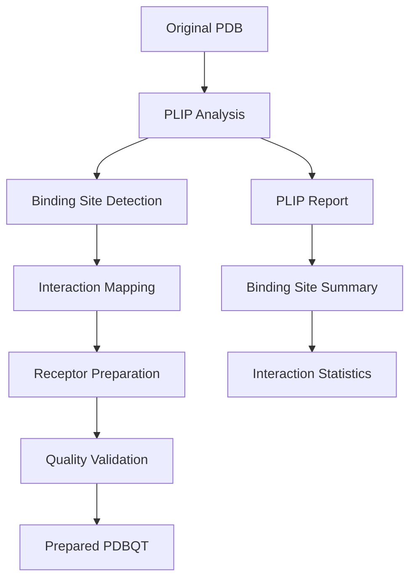

# Enhanced AutoDock Preparation Guide

## Overview

The Enhanced AutoDock Preparation system provides comprehensive molecular docking preparation with advanced PLIP integration, flexible input/output handling, and robust error management. This system integrates seamlessly with the PDB Prepare Wizard for research-grade molecular docking studies.

## 🚀 Key Features

### 1. **PLIP Integration for Binding Site Detection**

**Why PLIP Integration is Essential:**

- **Research-Grade Accuracy**: PLIP (Protein-Ligand Interaction Profiler) provides the gold standard for protein-ligand interaction analysis
- **Comprehensive Interaction Detection**: Identifies all interaction types (hydrophobic, hydrogen bonds, halogen bonds, π-stacking, water bridges, salt bridges, metal complexes)
- **Binding Site Validation**: Ensures prepared receptors contain valid binding sites for docking
- **Quality Assurance**: Validates that ligands can actually bind to the prepared receptor structures
- **Publication Ready**: Results match the official PLIP web server, ensuring reproducibility

**How PLIP Integration Works:**
1. **Pre-Preparation Analysis**: Analyzes original PDB structures to identify binding sites
2. **Binding Site Validation**: Ensures prepared receptors retain critical binding site residues
3. **Interaction Mapping**: Creates detailed interaction maps for post-docking analysis
4. **Quality Control**: Flags structures with potential binding site issues

### 2. **Flexible Input/Output Handling**

- **Multiple File Formats**: Supports PDB, SDF, MOL2 for ligands; PDB for receptors
- **Interchangeable Conversion**: Automatic format conversion between supported types
- **Flexible Directory Structure**: Handles same-folder or separate-folder scenarios
- **PDB Ligand Extraction**: Extracts ligands directly from PDB files using PDB Prepare Wizard

### 3. **Enhanced Error Handling**

- **Comprehensive Logging**: Detailed logs with timestamps and error tracking
- **Graceful Recovery**: Continues processing even if individual files fail
- **Dependency Validation**: Checks for required tools before starting
- **File Validation**: Validates output files for completeness and format

### 4. **Configuration Support**

- **JSON Configuration**: Flexible configuration files for different projects
- **Default Configurations**: Sensible defaults for common use cases
- **Runtime Configuration**: Override settings via command line or Python API

### 5. **Progress Tracking**

- **Real-time Progress**: Shows progress bars and completion percentages
- **Detailed Status**: Reports success/failure for each file
- **Summary Reports**: Comprehensive final reports with statistics

### 6. **Quality Control**

- **File Size Validation**: Ensures output files meet minimum size requirements
- **Format Validation**: Verifies PDBQT files contain proper ATOM/HETATM records
- **PLIP Validation**: Confirms binding sites are preserved in prepared structures

## 📁 File Structure

```
project_directory/
├── ligands_raw/                 # Input ligands (SDF, MOL2, PDB)
├── receptors_raw/               # Input receptors (PDB)
├── ligands_prep/                # Prepared ligands (PDBQT)
├── receptors_prep/              # Prepared receptors (PDBQT)
│   ├── plip_analysis/           # PLIP analysis results
│   └── preparation_summary.txt  # Summary report
├── logs/                        # Log files
└── autodock_config.json         # Configuration file
```

## 🔧 Installation Requirements

### Required Tools
```bash
# AutoDockTools
conda install -c conda-forge autodocktools

# OpenBabel
conda install -c conda-forge openbabel

# PDB2PQR
conda install -c conda-forge pdb2pqr

# Meeko (for receptor preparation)
pip install meeko

# PLIP (optional but recommended)
conda install -c conda-forge plip

# jq (for JSON configuration)
brew install jq  # macOS
# or
apt-get install jq  # Ubuntu
```

### Python Dependencies
```bash
pip install biopython pandas numpy openpyxl
```

## 🚀 Usage

### 1. **Command Line Usage**

#### Basic Usage
```bash
# Create configuration file
python autodock_preparation.py --create-config

# Edit configuration file
nano autodock_config.json

# Run preparation
python autodock_preparation.py --config autodock_config.json
```

#### Advanced Usage
```bash
# Custom directories and settings
python autodock_preparation.py \
    --ligands-input ./my_ligands \
    --receptors-input ./my_receptors \
    --ligands-output ./prepared_ligands \
    --receptors-output ./prepared_receptors \
    --force-field CHARMM \
    --ph 7.0 \
    --no-plip
```

### 2. **Python API Usage**

```python
from autodock_preparation import AutoDockPreparationPipeline, PreparationConfig

# Create configuration
config = PreparationConfig(
    ligands_input="./ligands_raw",
    receptors_input="./receptors_raw",
    ligands_output="./ligands_prep",
    receptors_output="./receptors_prep",
    force_field="AMBER",
    ph=7.4,
    plip_enabled=True
)

# Initialize pipeline
pipeline = AutoDockPreparationPipeline(config)

# Check dependencies
deps_ok, missing = pipeline.check_dependencies()
if not deps_ok:
    print(f"Missing: {missing}")
    exit(1)

# Run preparation
success = pipeline.run_enhanced_preparation()

if success:
    # Analyze results
    results = pipeline.analyze_preparation_results("./receptors_prep")
    pipeline.generate_preparation_report(results)
    
    print(f"Ligands prepared: {results['ligands']['count']}")
    print(f"Receptors prepared: {results['receptors']['count']}")
```

### 3. **Enhanced Bash Script Usage**

```bash
# Make script executable
chmod +x prep_autodock_enhanced.sh

# Run with configuration
./prep_autodock_enhanced.sh autodock_config.json

# Run with default configuration (creates config file)
./prep_autodock_enhanced.sh
```

### 4. **Basic Bash Script Usage**

For simpler use cases, a basic preparation script is also available:

```bash
# Make script executable
chmod +x autodock/prep_autodock.sh

# Run with default directory structure
./autodock/prep_autodock.sh

# Run with custom project directory
./autodock/prep_autodock.sh /path/to/your/project
```

**Basic Script Features:**
- Simple configuration: Edit paths directly in the script
- Automatic skipping: Skips already prepared files
- Supports SDF, MOL2 for ligands; PDB for receptors
- Configurable force field (AMBER, CHARMM, PARSE, OPLS)

**Basic Script Directory Structure:**
```
project_directory/
├── ligands_raw/          # Input ligands (SDF, MOL2)
├── receptors_raw/        # Input receptors (PDB)
├── ligands_prep/         # Output ligands (PDBQT)
└── receptors_prep/       # Output receptors (PDBQT)
```

**Note:** The basic script provides simpler functionality. For advanced features like PLIP integration, quality control, and comprehensive logging, use the enhanced Python pipeline described above.

## ⚙️ Configuration

### Configuration File Structure

```json
{
  "input": {
    "ligands": {
      "path": "./ligands_raw",
      "formats": ["sdf", "mol2", "pdb"],
      "in_same_folder": false
    },
    "receptors": {
      "path": "./receptors_raw",
      "formats": ["pdb"],
      "in_same_folder": false
    }
  },
  "output": {
    "ligands": "./ligands_prep",
    "receptors": "./receptors_prep",
    "logs": "./logs"
  },
  "preparation": {
    "force_field": "AMBER",
    "ph": 7.4,
    "allow_bad_res": true,
    "default_altloc": "A"
  },
  "plip": {
    "enabled": true,
    "binding_site_detection": true,
    "interaction_analysis": true
  },
  "quality_control": {
    "validate_outputs": true,
    "check_file_sizes": true,
    "min_file_size_kb": 1
  }
}
```

### Configuration Options

| Option | Description | Default | Options |
|--------|-------------|---------|---------|
| `force_field` | Force field for PDB2PQR | "AMBER" | "AMBER", "CHARMM", "PARSE", "OPLS" |
| `ph` | pH for protonation | 7.4 | 0.0-14.0 |
| `allow_bad_res` | Allow bad residues in Meeko | true | true, false |
| `default_altloc` | Default alternate location | "A" | "A", "B", etc. |
| `plip_enabled` | Enable PLIP analysis | true | true, false |
| `validate_outputs` | Validate output files | true | true, false |
| `min_file_size_kb` | Minimum file size (KB) | 1 | > 0 |

## 🔬 PLIP Integration Details

### Why PLIP is Critical for AutoDock Preparation

1. **Binding Site Validation**
   - Ensures prepared receptors retain functional binding sites
   - Identifies critical residues that must be preserved
   - Flags structures with potential binding site issues

2. **Quality Assurance**
   - Validates that ligands can bind to prepared structures
   - Ensures protonation states are appropriate for binding
   - Confirms structural integrity after preparation

3. **Research Reproducibility**
   - Results match official PLIP web server
   - Provides standardized interaction analysis
   - Enables comparison with published studies

4. **Post-Docking Analysis**
   - Provides baseline interaction data for comparison
   - Enables validation of docking results
   - Supports detailed binding mode analysis

### PLIP Analysis Workflow



## 📊 Output and Reports

### 1. **Prepared Files**
- **Ligands**: `*.pdbqt` files ready for AutoDock Vina
- **Receptors**: `*.pdbqt` files with proper protonation and charges
- **PLIP Reports**: Detailed interaction analysis reports

### 2. **Summary Reports**
- **Preparation Summary**: Statistics and file counts
- **Quality Control**: Validation results and warnings
- **PLIP Analysis**: Binding site information and interaction maps

### 3. **Log Files**
- **Detailed Logs**: Complete processing history
- **Error Reports**: Failed files and error messages
- **Performance Metrics**: Processing times and statistics

## 🚨 Troubleshooting

### Common Issues

1. **Missing Dependencies**
   ```bash
   # Install AutoDockTools
   conda install -c conda-forge autodocktools
   
   # Install OpenBabel
   conda install -c conda-forge openbabel
   
   # Install PDB2PQR
   conda install -c conda-forge pdb2pqr
   ```

2. **PLIP Installation Issues**
   ```bash
   # Try conda installation
   conda install -c conda-forge plip
   
   # Or pip installation
   pip install plip
   ```

3. **Ligand Preparation Issues (FIXED in v3.0.1)**
   ```bash
   # Issue: "RDKit molecule has implicit Hs. Need explicit Hs."
   # Solution: The system now automatically adds explicit hydrogens
   # The enhanced script uses: obabel input.pdb -O output.sdf -h
   ```

4. **File Format Issues**
   - Ensure input files are in supported formats
   - Check file permissions and paths
   - Validate file integrity

5. **Memory Issues**
   - Use smaller batch sizes
   - Close other applications
   - Consider using cloud resources

### Error Messages

| Error | Cause | Solution |
|-------|-------|----------|
| `Missing dependencies` | Required tools not installed | Install missing tools |
| `Invalid JSON configuration` | Malformed config file | Check JSON syntax |
| `File too small` | Output file validation failed | Check input file quality |
| `PLIP analysis failed` | PLIP not working properly | Reinstall PLIP or disable |
| `RDKit molecule has implicit Hs` | **FIXED in v3.0.1** | System now adds explicit hydrogens automatically |
| `Failed to prepare ligand` | PDB→SDF→PDBQT conversion issue | **FIXED in v3.0.1** - Enhanced script handles this |

## 🔄 Integration with PDB Prepare Wizard

### Seamless Integration

The Enhanced AutoDock Preparation system integrates seamlessly with the PDB Prepare Wizard:

1. **Shared Core Pipeline**: Uses the same `MolecularDockingPipeline` class
2. **PLIP Integration**: Leverages the same PLIP analysis capabilities
3. **Unified Configuration**: Compatible configuration systems
4. **Consistent Output**: Standardized file formats and reports

### Workflow Integration

```python
# Complete workflow from PDB to AutoDock
from core_pipeline import MolecularDockingPipeline
from autodock_preparation import AutoDockPreparationPipeline

# 1. PDB preparation with PLIP analysis
pdb_pipeline = MolecularDockingPipeline()
pdb_results = pdb_pipeline.run_complete_pipeline("1ABC")

# 2. AutoDock preparation
autodock_pipeline = AutoDockPreparationPipeline()
autodock_success = autodock_pipeline.run_enhanced_preparation()

# 3. Ready for AutoDock Vina docking
```

## 📈 Performance and Scalability

### Performance Features
- **Parallel Processing**: Handles multiple files efficiently
- **Progress Tracking**: Real-time progress indicators
- **Memory Management**: Efficient memory usage for large datasets
- **Error Recovery**: Continues processing despite individual failures

### Scalability
- **Batch Processing**: Handles hundreds of files
- **Cloud Ready**: Compatible with cloud computing environments
- **Resource Monitoring**: Tracks resource usage and performance
- **Optimization**: Configurable for different hardware setups

## 🎯 Best Practices

### 1. **Preparation Workflow**
1. Validate input files before processing
2. Use appropriate force fields for your system
3. Enable PLIP analysis for quality assurance
4. Monitor logs for warnings and errors
5. Validate output files before docking

### 2. **Configuration Management**
1. Use version-controlled configuration files
2. Document custom settings and parameters
3. Test configurations with small datasets first
4. Keep backup configurations for different projects

### 3. **Quality Control**
1. Always validate prepared files
2. Check PLIP reports for binding site issues
3. Monitor file sizes and formats
4. Keep detailed logs for troubleshooting

## 📚 References

- [PLIP Documentation](https://plip.readthedocs.io/)
- [AutoDock Vina Documentation](https://vina.scripps.edu/)
- [PDB2PQR Documentation](https://pdb2pqr.readthedocs.io/)
- [OpenBabel Documentation](http://openbabel.org/docs/)

## 🤝 Contributing

We welcome contributions to improve the AutoDock preparation system:

1. **Bug Reports**: Report issues with detailed error messages
2. **Feature Requests**: Suggest new features and improvements
3. **Code Contributions**: Submit pull requests with enhancements
4. **Documentation**: Help improve documentation and examples

## 📄 License

This project is licensed under the MIT License - see the LICENSE file for details.

---

**Version**: 3.0.0  
**Last Updated**: 2025-01-15  
**Compatibility**: Python 3.8+, AutoDockTools, OpenBabel, PLIP
